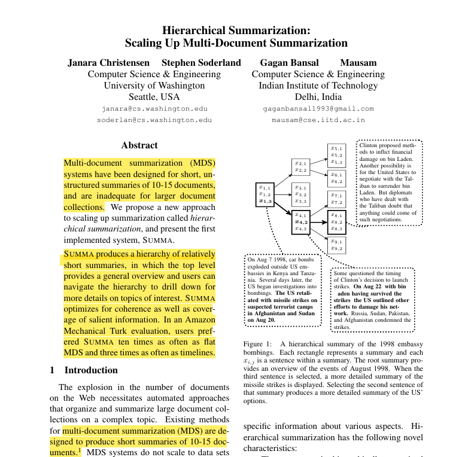
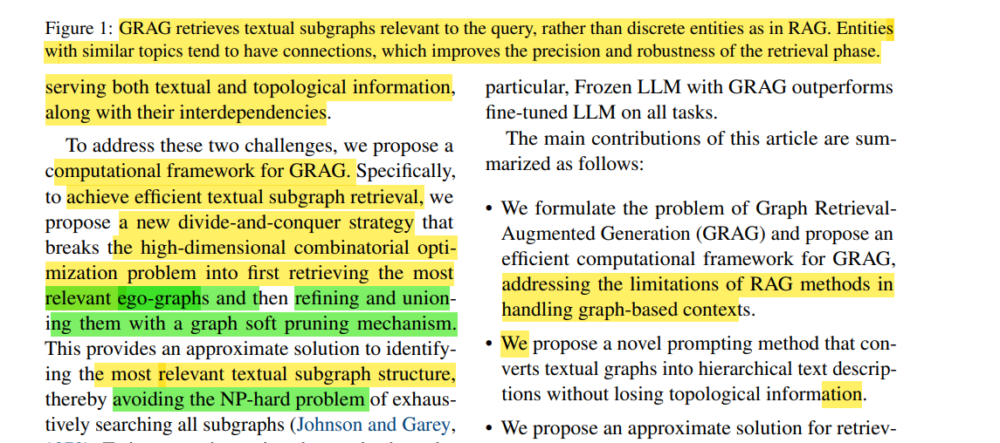
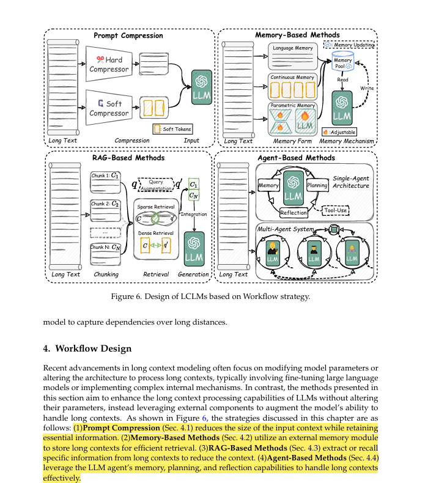

<!-- Long-Context LLMs Meet RAG: Overcoming Challenges for Long Inputs in RAG -->

*Bowen Jin, Jinsung Yoon, Jiawei Han, Sercan Ö. Arık. Google Cloud AI Research, University of Illinois at Urbana-Champaign*

<!-- Hierarchical Summarization: Scaling Up Multi-Document Summarization -->

*Janara Christensen, Stephen Soderland, Gagan Bansal, Mausam. University of Washington, Indian Institute of Technology Delhi*

<!-- GRAG: Graph Retrieval-Augmented Generation -->

*Yuntong Hu, Zhihan Lei, Zheng Zhang, Bo Pan, Chen Ling, Liang Zhao. Emory University*

<!-- A Comprehensive Survey on Long Context Language Modeling -->

*Jiaheng Liu, Dawei Zhu, Zhiqi Bai, Yancheng He, Huanxuan Liao, Haoran Que, Zekun Wang, Chenchen Zhang, Ge Zhang, Jiebin Zhang, Yuanxing Zhang, Zhuo Chen, Hangyu Guo, Shilong Li, Ziqiang Liu, Yong Shan, Yifan Song, Jiayi Tian, Wenhao Wu, Zhejian Zhou, Ruijie Zhu, Junlan Feng, Yang Gao, Shizhu He, Zhoujun Li, Tianyu Liu, Fanyu Meng, Wenbo Su, Yingshui Tan, Zili Wang, Jian Yang, Wei Ye, Bo Zheng, Wangchunshu Zhou, Wenhao Huang, Sujian Li, Zhaoxiang Zhang. NJU, PKU, CASIA, Alibaba, ByteDance, Tencent, Kuaishou, M-A-P*